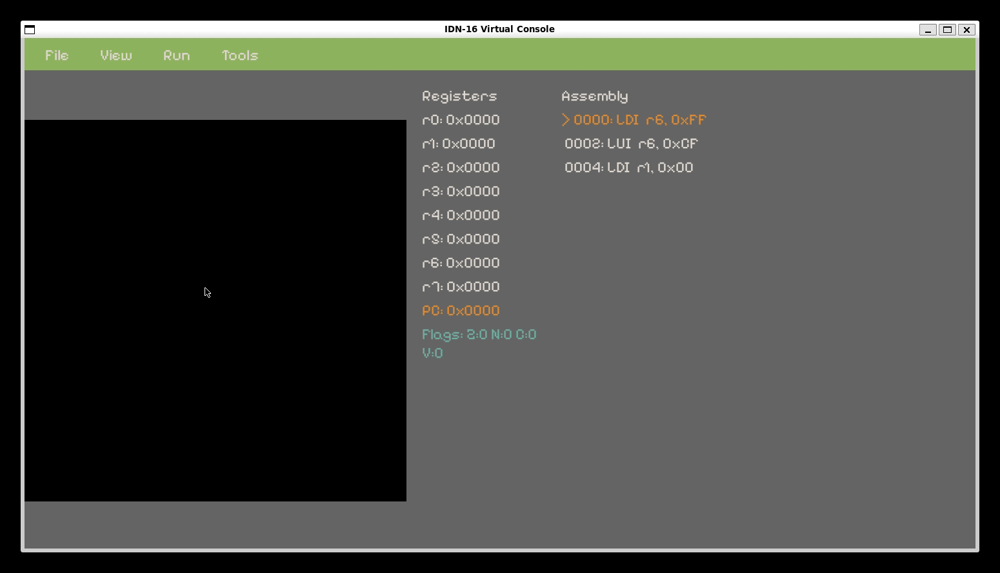
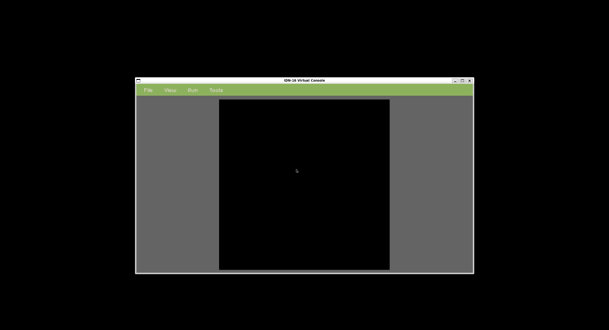
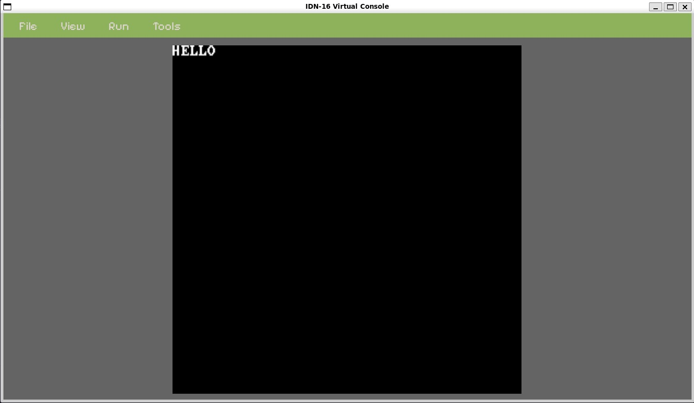
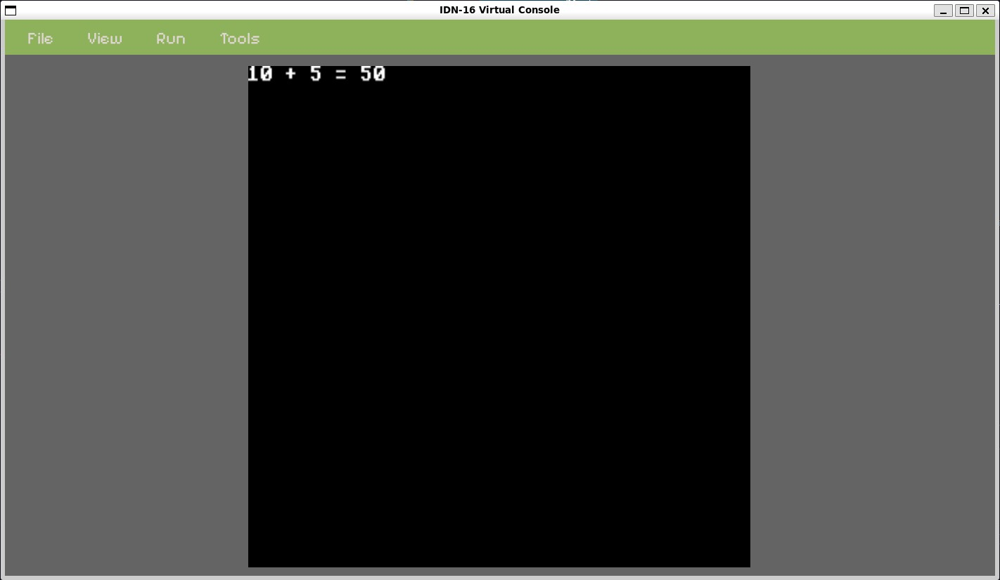
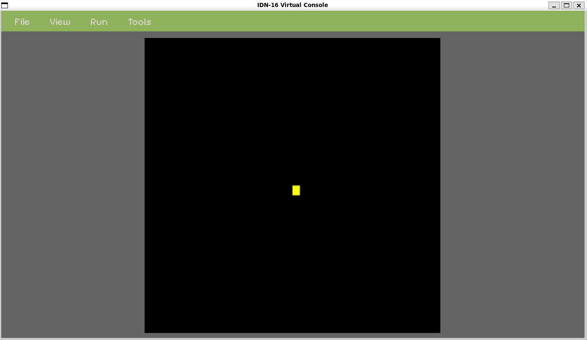
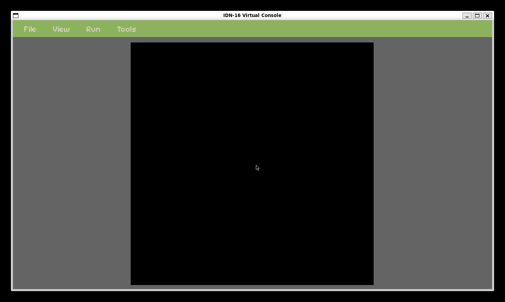
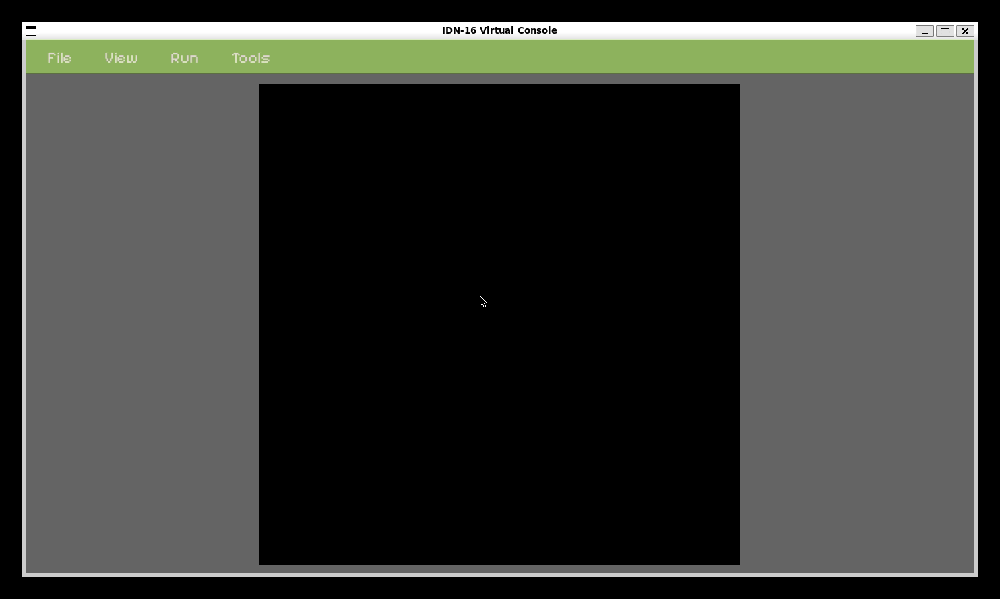

# `IDN-16` Console
## Table of Contents
- [`IDN-16` Console](#idn-16-console)
  - [Table of Contents](#table-of-contents)
  - [About](#about)
  - [Getting Started](#getting-started)
    - [Prerequisites](#prerequisites)
    - [Installing](#installing)
  - [GUI Interface](#gui-interface)
    - [Menu System](#menu-system)
  - [Keyboard Shortcuts](#keyboard-shortcuts)
    - [Execution Control](#execution-control)
    - [File Operations](#file-operations)
    - [View Controls](#view-controls)
    - [Debug Features](#debug-features)
  - [Tools](#tools)
    - [Assembler](#assembler)
      - [Technical Architecture](#technical-architecture)
    - [Disassembler](#disassembler)
    - [Example Programs](#example-programs)
  - [Documentation](#documentation)
    - [Memory Mapping](#memory-mapping)
      - [High-level Memory Layout](#high-level-memory-layout)
      - [Video Memory Layout (0xD000-0xEFFF)](#video-memory-layout-0xd000-0xefff)
    - [IO-Interfacing](#io-interfacing)
      - [Audio System (0xF000-0xF0FF)](#audio-system-0xf000-0xf0ff)
      - [Input System (0xF100-0xF1FF)](#input-system-0xf100-0xf1ff)
      - [System Control (0xF200-0xF2FF)](#system-control-0xf200-0xf2ff)
      - [Video Control Registers (0xD4B0-0xD4CF)](#video-control-registers-0xd4b0-0xd4cf)
    - [System Architecture](#system-architecture)
    - [System Call Functions](#system-call-functions)
      - [Display \& Graphics Functions](#display--graphics-functions)
      - [Input \& Control Functions](#input--control-functions)
      - [Sprite Management \& Animation Functions](#sprite-management--animation-functions)
      - [Timer \& System Functions](#timer--system-functions)
      - [Math \& Utility Functions](#math--utility-functions)
      - [Audio Functions](#audio-functions)
    - [Sprite System (Direct Memory Access)](#sprite-system-direct-memory-access)
    - [CPU Architecture](#cpu-architecture)
      - [Registers](#registers)
      - [Status Flags](#status-flags)
    - [Instruction Set](#instruction-set)
      - [Instruction Formats](#instruction-formats)
    - [Specific Opcodes and categories](#specific-opcodes-and-categories)
      - [REG-Format Instructions](#reg-format-instructions)
      - [IMM-Format Instructions](#imm-format-instructions)
      - [JB-Format Instructions](#jb-format-instructions)
      - [SP-Format (and extra) Instructions](#sp-format-and-extra-instructions)
    - [Assembly Language](#assembly-language)
      - [Syntax Overview](#syntax-overview)
      - [Variables and Constants](#variables-and-constants)
      - [Addressing Modes](#addressing-modes)
      - [Psuedo-Instructions / Macros](#psuedo-instructions--macros)
      - [Enhanced NOP Instruction](#enhanced-nop-instruction)
  - [Development](#development)
    - [Development Tools](#development-tools)
    - [Testing](#testing)

## About

`IDN-16` is a 16-bit, simulated console featuring a custom CPU architecture, memory-mapped I/O, and a RISC-V inspired custom instruction set. This serves as a way for me to solidify what I learned about low-level computer architecture, emulation techniques, and graphics programming, while creating something that I find fun and creatively satisfying.



## Getting Started

These instructions will get you a copy of the project up and running on your local machine for development and testing purposes.

### Prerequisites

You will need the following software installed:

- `GCC` or `Clang` (C compiler)
- `CMake` (version 3.10 or higher)
- `Git` (to clone the repository)

For Ubuntu/Debian, these can be installed by running the following:
```bash
sudo apt update 
sudo apt install build-essential cmake git
```

**Note:** SDL3 and other dependencies are automatically downloaded and built by CMake using FetchContent.

### Installing

**Clone the repository**
```bash
git clone https://github.com/IkechiNk/IDN-16.git
cd IDN-16
```

**Building the project**
```bash
cmake -B build
cmake --build build
```
NOTE: WHEN GETTING "{lib}.dll" is not a .so shared library, this problem occurs becuase cmake is returning the windows path to the libary (usually on the WSL subsystem). A temporary fix for this would be to disable [interop in wsl.conf](https://learn.microsoft.com/en-us/windows/wsl/wsl-config#example-wslconf-file).

This will build the main IDN-16 emulator with integrated assembler and disassembler tools.

**Quick Start Example**
```bash
# Build the project
cmake -B build
cmake --build build

# Create a simple program that displays "H"
echo "start:
    LDI r1, 'H'
    LOAD16 r2, 0xF301
    JSR r2
    idle:
    JMP idle" > hello.asm

# Run the emulator
./build/idn16

# In the GUI:
# 1. Tools → Assembler → Select hello.asm → Save as hello.bin
# 2. File → Open ROM → Select hello.bin
# 3. Run → Start/Resume
```

**Development Workflow**
```bash
# Edit your assembly file
vim program.asm

# Run the emulator
./build/idn16

# In the GUI:
# 1. Tools → Assembler → Select program.asm → Save as program.bin
# 2. File → Open ROM → Select program.bin
# 3. Run → Start/Resume to execute
# 4. View → CPU Registers and/or Assembly listings for debugging
```

## GUI Interface

The IDN-16 emulator features a comprehensive GUI with menu-driven navigation for all major functions.

### Menu System

**File Menu:**
- **Open ROM** - Load a binary ROM file (.bin, .rom) into the emulator
- **Close ROM** - Unload the current ROM and reset the system
- **Exit** - Close the emulator application

**View Menu:**
- **CPU Registers** - Toggle real-time display of all 8 CPU registers (r0-r7)
- **Assembly Listing** - Toggle assembly code view with current instruction highlighting

**Run Menu:**
- **Start/Resume** - Begin or continue program execution
- **Pause** - Pause program execution while maintaining state
- **Step Instruction** - Execute a single instruction for debugging
- **Reset CPU** - Reset the processor to initial state

**Tools Menu:**
- **Assembler** - Convert assembly (.asm) files to binary ROM files
- **Disassembler** - Convert binary ROM files back to readable assembly
- **Memory Dump** - Interactive tool to examine memory contents

## Keyboard Shortcuts

The emulator supports keyboard shortcuts for quick access to common functions:

### Execution Control
| Key | Function |
|-----|----------|
| **F5** | Start/Resume execution |
| **F6** | Pause execution |
| **F7** | Step single instruction |
| **F8** | Step over (execute through subroutines) |
| **SPACE** | Step single instruction (alternative) |
| **Ctrl+R** | Reset CPU |

### File Operations
| Key | Function |
|-----|----------|
| **Ctrl+O** | Open ROM file |
| **Ctrl+W** | Close ROM |
| **Ctrl+Q** | Quit application |
| **ESC** | Exit application |

### View Controls
| Key | Function |
|-----|----------|
| **F9** | Toggle CPU registers display |
| **F10** | Toggle assembly listing |
| **F11** | Toggle memory dump window |
| **F12** | Toggle fullscreen mode |

### Debug Features
| Key | Function |
|-----|----------|
| **Ctrl+D** | Open memory dump tool |
| **Ctrl+G** | Go to address (show current PC) |

## Tools

### Assembler

The IDN-16 includes a sophisticated assembler built using industry-standard compiler construction tools (Flex and Bison) that compiles assembly language programs into binary machine code for the IDN-16 console.

**Usage:**
1. Start the IDN-16 emulator: `./build/idn16`
2. Go to **Tools → Assembler** in the menu
3. Select your assembly source file (`input.asm`)
4. Choose where to save the binary output file (`output.bin`)
5. The assembler will process your code and create the binary



#### Technical Architecture

**Lexical Analysis (Flex)**
- **File**: `src/tools/assembler/lexer.l`
- Tokenizes assembly source code using Flex lexical analyzer
- Supports case-insensitive instruction mnemonics (ADD/add, MOV/mov, etc.)
- Recognizes multiple immediate value formats: decimal, hexadecimal (0x), binary (0b), character literals ('c')
- Automatic program counter tracking during tokenization
- Intelligent immediate value classification (IMM5, IMM8, OFFSET, IMM16) based on value ranges
- Comprehensive error reporting with token information and line numbers

**Syntax Analysis (Bison)**
- **File**: `src/tools/assembler/parser.y`
- Defines formal grammar for IDN-16 assembly language syntax
- Handles all instruction formats: REG, IMM, JB (Jump/Branch), and SP (Special)
- Supports pseudo-instructions and macro expansions (LOAD16, PUSH, POP)
- Semantic actions trigger code generation during parsing
- Built-in syntax error recovery and detailed error messages

**Symbol Table Management**
- **File**: `src/tools/assembler/symbol_table.c`
- Dynamic symbol storage supporting up to 8,192 symbols
- Efficient binary search implementation using qsort/bsearch algorithms
- Dual symbol types: labels (type 0) and constants/variables (type 1)
- Automatic memory management with proper cleanup routines
- Forward reference resolution for undefined symbols

**Code Generation Engine**
- **File**: `src/tools/assembler/codegen.c`
- Modular instruction encoding for different format types
- Immediate value validation with format-specific range checking
- Forward reference tracking system for unresolved identifiers
- Pseudo-instruction expansion:
  - `LOAD16 reg, imm16` → `LDI reg, low_byte; LUI reg, high_byte`
  - `PUSH reg` → `ADDI sp, sp, -2; STW reg, [sp]`
  - `POP reg` → `LDW reg, [sp]; ADDI sp, sp, 2`
- Binary output generation with efficient memory layout

**Two-Pass Assembly Process**
1. **First Pass (Parsing)**: 
   - Lexical analysis tokenizes source code
   - Parser builds intermediate representation
   - Symbol table populated with labels and constants
   - Forward references recorded for later resolution
   - Program counter tracking for address calculation

2. **Second Pass (Finalization)**:
   - Symbol table sorted for efficient binary search
   - Forward references resolved using symbol lookup
   - Final machine code generation with resolved addresses
   - Binary output file creation

**Advanced Features**
- **Range Validation**: Immediate values validated against instruction-specific constraints
- **Memory Efficiency**: Compact 16-bit instruction encoding
- **Error Handling**: Comprehensive error reporting with line numbers and context
- **Macro Support**: Complex pseudo-instructions expanded into multiple machine instructions
- **Format Support**: Handles all IDN-16 instruction formats with proper bit field encoding

### Disassembler

The IDN-16 also includes an integrated disassembler to convert binary machine code back to readable assembly language.

**Usage:**
1. Start the IDN-16 emulator: `./build/idn16`
2. Go to **Tools → Disassembler** in the menu
3. Select the binary file containing IDN-16 machine code (`input.bin`)
4. Choose where to save the disassembled output file
5. The disassembler will generate readable assembly instructions

The disassembler will generate output showing each assembly instruction:

```
LDI  r1, 0x05
LDI  r2, 0x01
CMP  r1, r2
JEQ  4
HLT
```

### Example Programs

**Hello World**
```assembly
; Simple text output - displays "HELLO" on screen
start:
    LOAD16 r1, 0xF300       ; Clear screen
    JSR r1
    LDI r1, 'H'             ; Display each character
    LOAD16 r2, 0xF301       ; PUT_CHAR syscall
    JSR r2
    LDI r1, 'E'
    JSR r2
    LDI r1, 'L'
    JSR r2
    LDI r1, 'L'
    JSR r2                  ; 'L' twice
    LDI r1, 'O'
    JSR r2
idle:
  jmp idle
```



**Input Detection**
```assembly
; Check for button press and display result
start:
    LDI r1, 0               ; Controller 0
    LOAD16 r2, 0xF309       ; GET_INPUT syscall
    JSR r2
    CMP r1, r0              ; Any button pressed?
    JEQ start               ; No - keep checking
    LDI r1, '*'             ; Yes - display asterisk
    LOAD16 r2, 0xF301       ; PUT_CHAR
    JSR r2
idle:
    JMP idle
```

**Math Operations**
```assembly
; Calculate 10 * 5 using system call
start:
    LOAD16 r2, 0xF310       ; PRINT_DEC syscall
    LOAD16 r3, 0xF301       ; PRINT_CHAR syscall
    LDI r1, 10              ; First number
    JSR r2
    LDI r1, ' '
    JSR r3                  
    LDI r1, '+'
    JSR r3
    LDI r1, ' '
    JSR r3
    LDI r1, 5               ; Second number
    JSR r2
    LDI r1, ' '
    JSR r3
    LDI r1, '='
    JSR r3
    LDI r1, ' '
    JSR r3
    LDI r1, 10
    LDI r2, 5
    LOAD16 r3, 0xF30B       ; MULTIPLY syscall
    JSR r3                  ; r1 = result
    LOAD16 r2, 0xF310       ; PRINT_DEC syscall
    JSR r2                  ; Display result
idle:
    JMP idle

```



**Simple Sprite**
```assembly
; Create a yellow square sprite at screen center
start:
    ; First create a yellow square tile (tile_id 1)
    LOAD16 r5, 0xF314       ; SYSCALL_SET_TILE_PIXEL_COLOR
    LDI r1, 1               ; Tile id 1
    LDI r2, 0               ; x coord
    LDI r3, 0               ; y coord
    LDI r4, 14              ; Yellow Palette Index
    JSR r5                  ; Call syscall
    
    ; Create sprite at position (20, 15) with yellow tile
    LDI r1, 0               ; Sprite ID
    LDI r2, 20              ; X position
    LDI r3, 15              ; Y position
    LDI r4, 1               ; Tile ID (yellow square we just created)
    LOAD16 r5, 0xF311       ; SET_SPRITE syscall
    JSR r5
idle:
    JMP idle
```



**Timer Demo**
```assembly
; Display the number of seconds passed since program start
start:
    LDI r3, 0               ; r3 = elapsed seconds counter
    JSR r1
    
timer_loop:
    LDI r1, 1000            ; 1000ms = 1 second
    LOAD16 r2, 0xF323       ; SLEEP syscall
    JSR r2
    
    INC r3                  ; Increment elapsed seconds
    
    ; Reset cursor to (0,0)
    LDI r1, 0               ; X = 0
    LDI r2, 0               ; Y = 0
    LOAD16 r4, 0xF303       ; SET_CURSOR syscall
    JSR r4
    
    ; Display elapsed seconds
    MOV r1, r3              ; Move seconds count to r1
    LOAD16 r2, 0xF310       ; PRINT_DEC syscall
    JSR r2
    
    JMP timer_loop          ; Repeat
```


**Audio Input Demo**
```assembly
; Play a sound when player 1 presses button A (F key)
start:
    LOAD16 r1, 0xF300       ; Clear screen initially
    JSR r1
    
    ; Display instructions
    LDI r1, 'P'
    LOAD16 r2, 0xF301       ; PUT_CHAR
    JSR r2
    LDI r1, 'r'
    JSR r2
    LDI r1, 'e'
    JSR r2
    LDI r1, 's'
    JSR r2
    LDI r1, 's'
    JSR r2
    LDI r1, ' '
    JSR r2
    LDI r1, 'F'
    JSR r2

input_loop:
    ; Get controller 1 input
    LDI r1, 0               ; Controller 0 (Player 1)
    LOAD16 r2, 0xF309       ; GET_INPUT syscall
    JSR r2
    
    ; Check if button A (F key) is pressed (bit 0)
    LDI r2, 1               ; Mask for bit 0 (button A)
    AND r3, r1, r2          ; Check if bit 0 is set
    CMP r3, r0              ; Compare with 0
    JEQ input_loop          ; If not pressed, keep checking
play_sound:
    ; Start sound on channel 1 with long duration
    LDI r1, 1                   ; Channel 1 (sound effects)
    LOAD16 r2, 523              ; 523Hz frequency (C5 note)
    LOAD16 r3, 100             ; 100ms duration (long enough for sustained play)
    LOAD16 r4, 50               ; Volume 50
    LOAD16 r5, 0xF30A           ; PLAY_TONE_CHANNEL syscall
    JSR r5
    
    ; Keep playing while button is held
hold_loop:
    LDI r1, 0               ; Controller 0
    LOAD16 r2, 0xF309       ; GET_INPUT syscall
    JSR r2
    LDI r2, 1               ; Mask for bit 0
    AND r3, r1, r2          ; Check if still pressed
    JEQ stop_sound          ; If not pressed, stop sound
    
    ; Button still pressed - restart sound to keep it playing
    LDI r1, 1                   ; Channel 1 (sound effects)
    LOAD16 r2, 523              ; 523Hz frequency (C5 note)
    LOAD16 r3, 100             ; 100ms duration
    LOAD16 r4, 50               ; Volume 50
    LOAD16 r5, 0xF30A           ; PLAY_TONE_CHANNEL syscall
    JSR r5
    
    JMP hold_loop           ; Continue checking
    
stop_sound:
    ; Stop channel 1
    LDI r1, 1               ; Channel 1
    LOAD16 r2, 0xF30B       ; STOP_CHANNEL syscall
    JSR r2
    
    JMP input_loop          ; Continue checking for input

```

**Memory Access**
```assembly
; Store and retrieve data from memory
start:
    LOAD16 r1, 0x8000       ; RAM address
    LDI r2, 42              ; Store value 42
    STW r2, [r1]
    LDW r3, [r1]            ; Load it back
    MOV r1, r3              ; Move to r1 for display
    LOAD16 r2, 0xF310       ; PRINT_DEC
    JSR r2
idle:
    JMP idle
```


## Documentation

### Memory Mapping
#### High-level Memory Layout
The `IDN-16` has a 64KB byte-addressable memory space sectioned into several dedicated regions:
```
0x0000-0x7FFF: User ROM (32KB user program storage, read-only)
0x8000-0xCFFF: RAM (20KB general purpose, read-write)
0xD000-0xEFFF: Video Memory (8KB for graphics system)
0xF000-0xF0FF: Audio Registers (256 bytes)
0xF100-0xF1FF: Input Registers (256 bytes)
0xF200-0xF2FF: System Control (256 bytes for interrupts, timers)
0xF300-0xFFFF: System Calls (3328 bytes for system call range)
```

#### Video Memory Layout (0xD000-0xEFFF)
The video system uses a tile-based architecture with the following sub-regions:
```
0xD000-0xD4AF: Character Buffer (40x30 characters = 1200 bytes)
0xD4B0-0xD4CF: Video Control Registers (32 bytes)
0xD4D0-0xD4EF: Palette RAM (16 colors x 2 bytes RGB565 = 32 bytes)
0xD4F0-0xE2FF: Sprite Table (1200 sprites x 3 bytes = 3600 bytes)
0xE300-0xEFFF: Tileset Data (51 tiles x 64 bytes each, 8x8 pixels per tile)
```

**Display Specifications:**
- Resolution: 320x240 pixels (40x30 tiles, 8x8 pixels per tile)
- Colors: 16-color palette using RGB565 format
- Sprites: Up to 1200 hardware sprites with priority layers and flipping
- Architecture: Dual-mode system (text via syscalls, sprites via memory)
- Features: Smooth scrolling backgrounds, no complex pixel manipulation needed
### IO-Interfacing
The IDN-16 uses memory-mapped I/O for interfacing with hardware systems:

#### Audio System (0xF000-0xF0FF)
Multi-channel audio processing and sound generation registers:

**Channel 0 (Background Music/Melody):**
- **0xF000-0xF001**: Channel 0 Frequency (Hz)
- **0xF002-0xF003**: Channel 0 Duration (ms)
- **0xF004**: Channel 0 Volume (0-255)
- **0xF005**: Channel 0 Enable (0=off, 1=on)

**Channel 1 (Sound Effects):**
- **0xF006-0xF007**: Channel 1 Frequency (Hz)
- **0xF008-0xF009**: Channel 1 Duration (ms)
- **0xF00A**: Channel 1 Volume (0-255)
- **0xF00B**: Channel 1 Enable (0=off, 1=on)

**Channel 2 (Ambient Sounds):**
- **0xF00C-0xF00D**: Channel 2 Frequency (Hz)
- **0xF00E-0xF00F**: Channel 2 Duration (ms)
- **0xF010**: Channel 2 Volume (0-255)
- **0xF011**: Channel 2 Enable (0=off, 1=on)

**Channel 3 (UI/Menu Sounds):**
- **0xF012-0xF013**: Channel 3 Frequency (Hz)
- **0xF014-0xF015**: Channel 3 Duration (ms)
- **0xF016**: Channel 3 Volume (0-255)
- **0xF017**: Channel 3 Enable (0=off, 1=on)

**Global Audio Control:**
- **0xF018**: Master Volume (0-255)
- **0xF019**: Audio Enable (0=all channels off, 1=on)
- **0xF01A-0xF0FF**: Reserved for future audio features (230 bytes)

#### Input System (0xF100-0xF1FF)
**0xF100**: Controller 1 button state (read-only)
- Bit 0: F key (Action A)
- Bit 1: G key (Action B)
- Bit 2: Start
- Bit 3: Select
- Bit 4: W key (Up)
- Bit 5: S key (Down)
- Bit 6: A key (Left)
- Bit 7: D key (Right)

**0xF101**: Controller 2 button state (read-only)
- Bit 0: Action A
- Bit 1: Action B  
- Bit 2: Start
- Bit 3: Select
- Bit 4: Arrow Up
- Bit 5: Arrow Down
- Bit 6: Arrow Left
- Bit 7: Arrow Right

**0xF102 - 0xF1FF**: Reserved for additional input devices

**Key Mappings:**
- **Player 1**: WASD for movement, F/G for action buttons
- **Player 2**: Arrow keys for movement

#### System Control (0xF200-0xF2FF)
- **0xF200**: Reserved
- **0xF201**: Reserved
- **0xF202**: Timer counter (low byte)
- **0xF203**: Timer counter (high byte)
- **0xF206**: Frame counter (low byte)
- **0xF208**: Frame counter (high byte)

#### Video Control Registers (0xD4B0-0xD4CF)
- **0xD4B0**: Text cursor X position
- **0xD4B2**: Text cursor Y position

### System Architecture

The IDN-16 uses a **dual-mode graphics system**:

1. **Text System**: Controlled by system calls (0xF300+) for console-style character output
2. **Sprite System**: Controlled by direct memory writes to video memory (0xD000+)

**Text operations** use system calls and work like a traditional console.
**Sprite operations** require direct memory manipulation for maximum performance.

### System Call Functions
System calls handle text output, input, audio, math, sprite animation, and utility functions. These are accessed via specific memory addresses in the 0xF300-0xFFFF range. The IDN-16 now includes **35 total system calls** with enhanced sprite animation capabilities for game development.

#### Display & Graphics Functions
| Function            | Address | Inputs | Outputs | Description |
|-------------------- | ------- | ------ | ------- | ----------- |
| SYSCALL_CLEAR_SCREEN| 0xF300  | - | r1=success(1/0) | Clear entire 40x30 text screen |
| SYSCALL_PUT_CHAR    | 0xF301  | r1=char | r1=success(1/0) | Put 8x8 character at cursor position |
| SYSCALL_PUT_STRING  | 0xF302  | r1=string_addr, r2=max_length | r1=success(1/0) | Put string using 8x8 font |
| SYSCALL_SET_CURSOR  | 0xF303  | r1=x, r2=y | - | Set text cursor position (x, y) |
| SYSCALL_GET_CURSOR  | 0xF304  | - | r1=x, r2=y | Get current cursor position |
| SYSCALL_PUT_CHAR_AT | 0xF305  | r1=x, r2=y, r3=char | - | Put character at specific position |
| SYSCALL_SCROLL_UP   | 0xF306  | - | - | Scroll text screen up one line |
| SYSCALL_FILL_AREA   | 0xF307  | r1=x, r2=y, r3=width, r4=height, r5=char | - | Fill rectangular area with character |
| SYSCALL_SET_TEXT_COLOR | 0xF308 | r1=fg_color, r2=bg_color | - | Set foreground/background color |
| SYSCALL_SET_PALETTE | 0xF312  | r1=palette_index, r2=color | r1=success(1/0) | Set palette color (RGB565) |
| SYSCALL_SET_TILE_PIXEL | 0xF314 | r1=tile_id, r2=pixel_x, r3=pixel_y, r4=palette_index | r1=success(1/0) | Set individual tile pixel color |
| SYSCALL_PRINT_HEX   | 0xF30F  | r1=number | - | Print number in hexadecimal |
| SYSCALL_PRINT_DEC   | 0xF310  | r1=number | - | Print number in decimal |

#### Input & Control Functions
| Function            | Address | Inputs | Outputs | Description |
|-------------------- | ------- | ------ | ------- | ----------- |
| SYSCALL_GET_INPUT   | 0xF309  | r1=controller | r1=button_state | Get keyboard input |
| SYSCALL_SET_RETURN_ADDR | 0xF31C | - | r1=success(1/0) | Set return address register (r7) to next instruction |

#### Sprite Management & Animation Functions
| Function            | Address | Inputs | Outputs | Description |
|-------------------- | ------- | ------ | ------- | ----------- |
| SYSCALL_SET_SPRITE  | 0xF311  | r1=sprite_id, r2=x, r3=y, r4=tile_id | r1=success(1/0) | Set sprite position and tile |
| SYSCALL_MOVE_SPRITE | 0xF313  | r1=sprite_id, r2=new_x, r3=new_y | r1=success(1/0) | Move sprite to new position |
| SYSCALL_HIDE_SPRITE | 0xF316  | r1=sprite_id | r1=success(1/0) | Hide sprite by setting tile_id to 0 |
| SYSCALL_GET_SPRITE_POS | 0xF317 | r1=sprite_id | r1=x, r2=y | Get sprite x,y position |
| SYSCALL_CLEAR_SPRITE_RANGE | 0xF318 | r1=start_id, r2=end_id | r1=sprites_cleared | Clear sprite range |
| SYSCALL_CHECK_COLLISION | 0xF319 | r1=sprite1_id, r2=sprite2_id | r1=collision(1/0) | Check 8x8 sprite collision |
| SYSCALL_SHIFT_SPRITES | 0xF31A | r1=start_id, r2=count, r3=dx, r4=dy | r1=sprites_moved | Move multiple sprites with offset |
| SYSCALL_COPY_SPRITE | 0xF31B | r1=src_id, r2=dest_id | r1=success(1/0) | Copy sprite properties |
| SYSCALL_MOVE_SPRITE_RIGHT | 0xF31D | r1=sprite_id, r2=tiles | r1=success(1/0) | Move sprite right by N tiles |
| SYSCALL_MOVE_SPRITE_LEFT | 0xF31E | r1=sprite_id, r2=tiles | r1=success(1/0) | Move sprite left by N tiles |
| SYSCALL_MOVE_SPRITE_UP | 0xF31F | r1=sprite_id, r2=tiles | r1=success(1/0) | Move sprite up by N tiles |
| SYSCALL_MOVE_SPRITE_DOWN | 0xF320 | r1=sprite_id, r2=tiles | r1=success(1/0) | Move sprite down by N tiles |

#### Timer & System Functions
| Function            | Address | Inputs | Outputs | Description |
|-------------------- | ------- | ------ | ------- | ----------- |
| SYSCALL_GET_FRAME_COUNT | 0xF315 | - | r1=frame_count | Get current frame count |
| SYSCALL_TIMER_START | 0xF321 | r1=duration | r1=success(1/0) | Start timer with duration in milliseconds |
| SYSCALL_TIMER_QUERY | 0xF322 | r1=stop_flag | r1=0 if complete, remaining_ms if not; r2=timer_state (1=stopped, 0=running) | Query timer status, optionally stop timer if r1=1 |
| SYSCALL_SLEEP | 0xF323 | r1=duration | r1=success(1/0) | Set CPU sleep timer in milliseconds |

#### Math & Utility Functions
| Function            | Address | Inputs | Outputs | Description |
|-------------------- | ------- | ------ | ------- | ----------- |
| SYSCALL_MULTIPLY    | 0xF30B  | r1=a, r2=b | r1=result_low, r2=result_high | 16-bit multiply operation |
| SYSCALL_DIVIDE      | 0xF30C  | r1=dividend, r2=divisor | r1=quotient, r2=remainder | 16-bit divide operation |
| SYSCALL_RANDOM      | 0xF30D  | - | r1=random_number | Generate random number |
| SYSCALL_MEMCPY      | 0xF30E  | r1=dest, r2=src, r3=length | r1=bytes_copied | Memory copy operation |
| SYSCALL_NUMBER_TO_STRING | 0xF324 | r1=number, r2=dest_addr, r3=max_size, r4=base(10/16) | r1=string_length, r2=error_code(0=success) | Convert number to string in user memory |

#### Audio Functions
| Function            | Address | Inputs | Outputs | Description |
|-------------------- | ------- | ------ | ------- | ----------- |
| SYSCALL_PLAY_TONE_CHANNEL | 0xF30A | r1=channel(0-3), r2=freq, r3=duration, r4=volume | r1=success(1/0) | Play audio tone on specific channel |
| SYSCALL_STOP_CHANNEL | 0xF325 | r1=channel(0-3) | r1=success(1/0) | Stop audio playback on specific channel |
| SYSCALL_SET_MASTER_VOLUME | 0xF326 | r1=volume(0-255) | r1=success(1/0) | Set master audio volume |
| SYSCALL_STOP_ALL_AUDIO | 0xF327 | - | r1=success(1/0) | Stop all audio channels |


**Usage Examples:**

**Basic Text Display:**
```assembly
; Clear screen 
LOAD16 r1, 0xF300       ; SYSCALL_CLEAR_SCREEN
JSR r1                  ; r1 = success

; Set cursor position  
LDI r1, 10              ; x = 10
LDI r2, 5               ; y = 5
LOAD16 r3, 0xF303       ; SYSCALL_SET_CURSOR
JSR r3                  ; Set cursor

; Display a character
LDI r1, 'H'             ; Character 'H'
LOAD16 r2, 0xF301       ; SYSCALL_PUT_CHAR
JSR r2                  ; r1 = success
```

**Stack Management Example:**
```assembly
; Subroutine that preserves registers using PUSH/POP
subroutine_example:
    ; Initialize stack pointer (typically done at program start)
    LOAD16 sp, 0xCFFF       ; Set stack to top of RAM
    
    ; Save registers before computation
    PUSH r1
    PUSH r2
    PUSH r3
    
    ; Perform some computation
    LDI r1, 10
    LDI r2, 20
    ADD r3, r1, r2          ; r3 = r1 + r2
    
    ; Call another subroutine (demonstrates nested calls)
    LOAD16 r1, helper_function
    JSR r1
    
    ; Restore registers in reverse order
    POP r3
    POP r2
    POP r1
    
    RET

helper_function:
    ; This function can use PUSH/POP too
    PUSH r4
    PUSH r5
    
    ; Do some work...
    LDI r4, 42
    LDI r5, 24
    ADD r4, r4, r5
    
    ; Restore and return
    POP r5
    POP r4
    RET
```

### Sprite System (Direct Memory Access)

Sprites are controlled by writing directly to video memory regions:

**Memory Layout:**
- **Palette RAM**: 0xD4D0-0xD4EF (16 colors × 2 bytes, RGB565 format)
- **Sprite Table**: 0xD4F0-0xE2FF (1200 sprites × 3 bytes: [X (up to 40), Y (up to 30), Tile_ID])
- **Tileset Data**: 0xE300-0xEFFF (51 tiles × 64 bytes each: 8×8 pixel data, 1 byte palette index per pixel)

**Sprite System Rules:**
- Sprites are disabled when Tile_ID = 0
- Palette indices 1-15 = visible colors
- Palette indices 16+ = use previous valid palette color (1-15) from the current tile

**Creating Sprites with Direct Memory Writes:**
```assembly
; Memory addresses
PALETTE_RAM_START = 0xD4D0
SPRITE_TABLE_START = 0xD4F0
TILESET_DATA_START = 0xE300

; Set up red color in palette slot 1
LOAD16 r1, PALETTE_RAM_START
ADDI r1, r1, 2                 ; Palette slot 1 (2 bytes per color)
LOAD16 r2, 0xF800              ; Red color (RGB565)
STW r2, [r1+0]                 ; Write to palette

; Create red tile data (tile 0)
LOAD16 r1, TILESET_DATA_START  ; Tile 0 base address
LDI r2, 1                      ; Palette index 1 (red)
STB r2, [r1+0]                 ; Pixel (0,0), the rest is filled

; Set up sprite 0 in sprite table
LOAD16 r1, SPRITE_TABLE_START  ; Sprite table base
LDI r2, 100                    ; X position
STB r2, [r1+0]                 ; Write X coordinate
LDI r2, 80                     ; Y position
STB r2, [r1+1]                 ; Write Y coordinate
LDI r2, 1                      ; Tile ID 1 (Tile_ID 0 = disabled)
STB r2, [r1+2]                 ; Write tile ID
```

**Input Handling:**
```assembly
input_loop:
    LDI r1, 0           ; Controller 0
    JSR SYS_GET_KEYS    ; r1 = button state
    CMP r1, r0          ; Check if any buttons pressed
    JEQ input_loop      ; Loop if no input
    
    ; Check specific button (bit 0 = Action A)
    LDI r1, 0           ; Controller 0  
    LDI r2, 0           ; Bit 0 (Action A)
    JSR SYS_KEY_PRESSED ; r1 = 1 if pressed, 0 if not
    CMP r1, r0
    JEQ input_loop      ; Loop if Action A not pressed
    
    ; Action A was pressed, do something
    ; ...
```

### CPU Architecture
#### Registers
The `IDN-16`'s CPU has 8 16-bit registers:
| Register      | Purpose         | Notes                    |
| ------------- | --------------- | ------------------------ |
| r0 / zero     | Always Zero     | **Hardwired to 0 - writes ignored** |
| r1            | General         |                          |
| r2            | General         |                          |
| r3            | General         |                          |
| r4            | General         |                          |
| r5            | General         |                          |
| r6 / sp       | Stack Pointer   |                          |
| r7 / ra       | Return Address  |                          |

**Important:** Register r0 is hardwired to always contain zero. Any attempt to write to r0 will be ignored and the register will remain 0. This is enforced in hardware and cannot be overridden.
#### Status Flags
Statuses are stored with a special flag register:
- Zero (Z): Set when result is zero
- Negative (N): Set when result is negative
- Carry (C): Set when operation produces carry
- Overflow (V): Set when signed overflow occurs

### Instruction Set
#### Instruction Formats
All instructions are 16 bits wide:
| Formats                                 | Bit Allocation                                                  |
| --------------------------------------- | --------------------------------------------------------------- |
| REG-format (Register Operations)        | [5 bits opcode][3 bits rd][3 bits rs1][3 bits rs2][2 bits func] |
| IMM-Format (Immediate/Memory operations)| [5 bits opcode][3 bits rd][3 bits rs1][5 bits immediate]        |
| JB-Format (Jump/Branch operations)      | [5 bits opcode][11 bits jump offset]                            |
| SP-Format (Special operations)          | [5 bits opcode][3 bits rd][8 bits varies by instruction]        |

### Specific Opcodes and categories
#### REG-Format Instructions

| Opcode  | Assembly Syntax                       | Usage                               |
| ------- | ------------------------------------- | ------------------------------------|
| 00000   | ADD rd, rs1, rs2                      | Add registers                       |
| 00001   | SUB rd, rs1, rs2                      | Subtract registers                  |
| 00010   | AND rd, rs1, rs2                      | Bitwise AND                         |
| 00011   | OR rd, rs1, rs2                       | Bitwise OR                          |
| 00100   | XOR rd, rs1, rs2                      | Bitwise XOR                         |
| 00101   | SHL rd, rs1, rs2                      | Shift left                          |
| 00110   | SHR rd, rs1, rs2 (func=00)            | Shift right logical                 |
| 00110   | SRA rd, rs1, rs2 (func=01)            | Shift right arithmetic              |
| 00111   | MOV rd, rs1 (func=00)                 | Copy register                       |
| 00111   | CMP rd, rs1 (func=01)                 | Compare regs and set flags          |
| 00111   | NOT rd, rs1 (func=10)                 | Bitwise NOT                         |

#### IMM-Format Instructions

| Opcode  | Assembly Syntax                       | Usage                               | Immediate Size & Range | Binary note  |
| ------- | ------------------------------------- | ----------------------------------- | ---------------------- | --- |
| 01000   | LDI rd, imm                           | Load immediate (sign extends)       | 8 bits: -128 to +255   | The remaining 8 bits are used for the immediate |
| 01001   | LDW rd, [rs1+imm]                     | Load word from memory               | 5 bits: -16 to +31     |
| 01010   | STW rd, [rs1+imm]                     | Store word to memory                | 5 bits: -16 to +31     |
| 01011   | ADDI rd, rs1, imm                     | Add immediate (sign extends)        | 5 bits: -16 to +31     |
| 01100   | LUI rd, imm                           | Load immediate to upper 8 bits      | 8 bits: 0 to 255       | The remaining 8 bits are used for the immediate |
| 01101   | ANDI rd, rs1, imm                     | AND immediate (no sign extension)   | 5 bits: 0 to 31        |
| 01110   | ORI rd, rs1, imm                      | OR immediate (no sign extension)    | 5 bits: 0 to 31        |
| 01111   | XORI rd, rs1, imm                     | XOR immediate (no sign extension)   | 5 bits: 0 to 31        |

**Immediate Value Constraints:**
- **8-bit immediates** (LDI, LUI): Use bits 7-0 of instruction, allowing larger values
- **5-bit immediates** (all others): Use bits 4-0 of instruction  
- **Sign extension**: LDI and ADDI sign-extend their immediates to 16 bits
- **No sign extension**: LUI, ANDI, ORI, XORI use immediates as unsigned values
- **Address offsets**: LDW/STW use sign-extended 5-bit offsets for base+offset addressing

#### JB-Format Instructions

| Opcode  | Assembly Syntax                       | Usage                               | Binary note  |
| ------- | ------------------------------------- | ------------------------------------| ----- |
| 10000   | JMP offset                            | Unconditional jump                  |       |
| 10001   | JEQ offset                            | Jump if equal                       |       |
| 10010   | JNE offset                            | Jump if not equal                   |       |
| 10011   | JGT offset                            | Jump if greater than                |       |
| 10100   | JLT offset                            | Jump if less than                   |       |
| 10101   | JSR reg                               | Jump to subroutine + store pc in ra | This instruction uses the REG-format for its binary representation with rs1, rs2, and func code being blank |
| 10110   | RET                                   | Return by jumping to address in ra  | This instruction only contains the opcode, the remaining values are ignored|

#### SP-Format (and extra) Instructions

| Opcode  | Assembly Syntax                       | Usage                               | Binary Note |
| ------- | ------------------------------------- | ------------------------------------| ----------- |
| 11000   | HLT                                   | Halt processor                      |
| 11001   | NOP count                             | Insert 'count' NOP instructions     |
| 11010   | INC rd                                | Increment register                  |
| 11011   | DEC rd                                | Decrement register                  |
| 11100   | LDB rd, [rs1+imm]                     | Load byte from memory               | Treat as IMM-Format |
| 11101   | STB rd, [rs1+imm]                     | Store byte to memory                | Treat as IMM-Format |
### Assembly Language
#### Syntax Overview
```
; This is a comment
label:          ; Define a label
  LDI  sp, 10   ; Load immediate value 10 into r6
  LOAD16 r5, routine  ; Load routine address into r5
  JSR  r5       ; Jump to subroutine (JSR saves PC+2 to ra)
  HLT           ; Halt execution

routine:
  MOV  r1, sp   ; Copy r6 to r1
  RET           ; Return from subroutine (jumps to address in ra)
```

#### Variables and Constants
The assembler supports variable and constant definitions that can be used throughout your program:

```assembly
; Define constants
x = 10
y = 20
OFFSET = 0x100
MAX_SPRITES = 1200

; Define memory addresses
VIDEO_BASE = 0x3000

; Use in instructions
LDI r1, SCREEN_WIDTH        ; Load 320 into r1
LOAD16 r2, VIDEO_BASE       ; Load 0x3000 into r2
LDW r3, [r2 + OFFSET]       ; Load from address 0x3100
```

**Variable Assignment Syntax:**
- `IDENTIFIER = value` - Define a constant or memory address
- Values can be decimal, hexadecimal (`0x1234`), binary (`0b1010`), or character literals (`'A'`)
- Variables can be used anywhere an immediate value is expected
- Case-sensitive (`VIDEO_BASE` and `video_base` are different variables)
#### Addressing Modes
- **Immediate:** LDI r1, 5
- **Character:** LDI r1, 'a'
- **Register:** MOV r1, r2
- **Register Indirect with Offset:** LD r2, [r1+2]
#### Psuedo-Instructions / Macros
The assembler has support for pseudo-instructions / macros:
- **CALL** addr -> 
  - ```
    JSR addr
    ```
- **INC** reg -> 
  - ```
    ADDI reg, reg, 1
    ```
- **DEC** reg ->
  - ```
    ADDI reg, reg, -1
    ```
- **LOAD16** reg, imm16 ->
  - ```
    LDI reg, imm16[7:0]
    LUI reg, imm16[15:8]
    ```
- **PUSH** reg ->
  - ```
    ADDI sp, sp, -2
    STW reg, [sp]
    ```
- **POP** reg ->
  - ```
    LDW reg, [sp]
    ADDI sp, sp, 2
    ```

**Stack Behavior Notes:**
- The stack grows downward from 0xCFFF (top of RAM) to 0x8000 (bottom of RAM)
- Each PUSH decrements the stack pointer by 2 bytes (16-bit word size)
- Each POP increments the stack pointer by 2 bytes  
- Always POP in reverse order of PUSH to maintain stack integrity
- Initialize the stack pointer with `LOAD16 sp, 0xCFFF` at program start

#### Enhanced NOP Instruction
The NOP instruction supports multiple forms for efficient padding and alignment:

```assembly
; Basic NOP
NOP                     ; Single no-operation

; Multiple NOPs with immediate values
NOP 5                   ; Insert 5 NOP instructions
NOP 255                 ; Insert 255 NOP instructions
```

**Supported NOP Formats:**
- `NOP` - Single NOP instruction
- `NOP immediate` - Multiple NOPs

This is particularly useful for:
- Memory alignment and padding
- Function table organization  
- Creating gaps for future expansion
## Development

### Development Tools

The IDN-16 includes comprehensive development and debugging tools:

**Assembler Features:**
- Complete assembler with proper syntax highlighting support
- System ROM function name recognition (no manual address calculations)
- Label resolution and macro support
- Error reporting with line numbers

**Runtime Debug Features:**
- ROM loading support for easy program deployment
- Real-time display of CPU register state and memory contents



**Graphics Development:**
- Tile-based rendering system (40×30 tiles of 8×8 pixels)
- Sprite management with hardware acceleration
- Palette editor through direct memory access

### Testing

The project includes comprehensive test suites for both the CPU and memory subsystems. These tests verify the correct behavior of each instruction and memory operation.

**Running the tests:**
```bash
cmake -B build
cmake --build build
ctest --test-dir build
```

**Individual test components:**
```bash
ctest --test-dir build --verbose  # Run all tests with detailed output
```

The test suite uses Unity as the testing framework and validates:
- All CPU instructions (ADD, SUB, LDI, etc.)
- Memory read/write operations
- Memory-mapped I/O behavior
- Edge cases like register r0 operations, overflow conditions

---
This documentation will be expanded as development continues.
